# Дипломная работа курса SYS-38 «Системный администратор» - Мухтасипов Александр  

# Содержание
- [Задача](#Задача)  
- [Инфраструктура](#Инфраструктура)  
    - [Сайт](#Сайт)
    - [Мониторинг](#Мониторинг)
    - [Логи](#Логи)
    - [Сеть](#Сеть)
    - [Резервное копирование](#backup)
# Выполнение дипломной работы  
### Terraform
- [Инфраструктура](#terra)
    - [Сеть](#net)
    - [Группы безопасности](#group)
    - [Load Balancer](#balancer)
    - [Резервное копирование](#snapshot)
### Ansible
- [Установка и настройка ansible](#cfg)
- [NGINX](#web)
- [Мониторинг](#zabbix)
- Логи
    -  [Установка Elasticsearch](#elastic)
    -  [Установка Kibana](#kibana)
    -  [Установка Filebeat](#filebeat)

**ссылки на ресурсы**  
[Сайт](http://158.160.181.16/)  
[Kibana](http://158.160.78.37:5601/)  
[Zabbix](http://158.160.7.11/zabbix/zabbix.php?action=dashboard.view)

--- 

### <a id="Задача">Задача</a>  
Ключевая задача — разработать отказоустойчивую инфраструктуру для сайта, включающую мониторинг, сбор логов и резервное копирование основных данных. Инфраструктура должна размещаться в Yandex Cloud и отвечать минимальным стандартам безопасности: запрещается выкладывать токен от облака в git. 

### <a id="Инфраструктура">Инфраструктура</a> 
Для развёртки инфраструктуры используйте Terraform и Ansible.  

Не используйте для ansible inventory ip-адреса! Вместо этого используйте fqdn имена виртуальных машин в зоне ".ru-central1.internal". Пример: example.ru-central1.internal  

Важно: используйте по-возможности минимальные конфигурации ВМ:2 ядра 20% Intel ice lake, 2-4Гб памяти, 10hdd, прерываемая.  

Так как прерываемая ВМ проработает не больше 24ч, перед сдачей работы на проверку дипломному руководителю сделайте ваши ВМ постоянно работающими.  

Ознакомьтесь со всеми пунктами из этой секции, не беритесь сразу выполнять задание, не дочитав до конца. Пункты взаимосвязаны и могут влиять друг на друга.  

### <a id="Сайт">Сайт</a> 
Создайте две ВМ в разных зонах, установите на них сервер nginx, если его там нет. ОС и содержимое ВМ должно быть идентичным, это будут наши веб-сервера.

Используйте набор статичных файлов для сайта. Можно переиспользовать сайт из домашнего задания.

Создайте Target Group, включите в неё две созданных ВМ.

Создайте Backend Group, настройте backends на target group, ранее созданную. Настройте healthcheck на корень (/) и порт 80, протокол HTTP.

Создайте HTTP router. Путь укажите — /, backend group — созданную ранее.

Создайте Application load balancer для распределения трафика на веб-сервера, созданные ранее. Укажите HTTP router, созданный ранее, задайте listener тип auto, порт 80.

Протестируйте сайт curl -v <публичный IP балансера>:80

### <a id="Мониторинг">Мониторинг</a>
Создайте ВМ, разверните на ней Zabbix. На каждую ВМ установите Zabbix Agent, настройте агенты на отправление метрик в Zabbix.

Настройте дешборды с отображением метрик, минимальный набор — по принципу USE (Utilization, Saturation, Errors) для CPU, RAM, диски, сеть, http запросов к веб-серверам. Добавьте необходимые tresholds на соответствующие графики.

### <a id="Логи">Логи</a> 
Cоздайте ВМ, разверните на ней Elasticsearch. Установите filebeat в ВМ к веб-серверам, настройте на отправку access.log, error.log nginx в Elasticsearch.

Создайте ВМ, разверните на ней Kibana, сконфигурируйте соединение с Elasticsearch.

### <a id="Сеть">Сеть</a> 
Разверните один VPC. Сервера web, Elasticsearch поместите в приватные подсети. Сервера Zabbix, Kibana, application load balancer определите в публичную подсеть.

Настройте Security Groups соответствующих сервисов на входящий трафик только к нужным портам.

Настройте ВМ с публичным адресом, в которой будет открыт только один порт — ssh. Эта вм будет реализовывать концепцию bastion host . Синоним "bastion host" - "Jump host". Подключение ansible к серверам web и Elasticsearch через данный bastion host можно сделать с помощью ProxyCommand . Допускается установка и запуск ansible непосредственно на bastion host.(Этот вариант легче в настройке)

### <a id="backup">Резервное копирование</a> 
Создайте snapshot дисков всех ВМ. Ограничьте время жизни snaphot в неделю. Сами snaphot настройте на ежедневное копирование.  

---

# Выполнение дипломной работы

## В файле .gitignore скрываем файлы:

variables.tf (значения переменных cloud_id, folder_id)
terraform.tfstate
terraform.tfstate.backup
meta.txt (ключи ssh для подключения к ВМ)
.terraform.lock.hcl

## Terraform

### <a id="terra">Инфраструктура</a>  

Поднимаем инфраструктуру в Yandex Cloud используя **terraform**  

Передаем в файле variables.tf значения переменных в main.tf
```
var.cloud_id
var.folder_id
file("~/.authorized_key.json")
```
Проверим конфигурацию выполнив`terraform plan`
сверяем конфигурацию  и запускаем процесс поднятия инфраструктуры  командой `terraform apply`  

Вывод Outputs.tf

```
Apply complete! Resources: 30 added, 0 changed, 0 destroyed.

Outputs:

FQDN_bastion = "bastion.ru-central1.internal"
FQDN_elastic = "elastic.ru-central1.internal"
FQDN_kibana = "kibana.ru-central1.internal"
FQDN_web-1 = "web1.ru-central1.internal"
FQDN_web-2 = "web2.ru-central1.internal"
FQDN_zabbix = "zabbix.ru-central1.internal"
external_ip_address_L7balancer = tolist([
  {
    "address" = "158.160.181.16"
  },
])
external_ip_address_bastion = "158.160.30.12"
external_ip_address_kibana = "158.160.78.37"
external_ip_address_zabbix = "158.160.7.11"
internal_ip_address_bastion = "10.0.4.4"
internal_ip_address_elastic = "10.0.3.3"
internal_ip_address_kibana = "10.0.4.6"
internal_ip_address_web-1 = "10.0.1.3"
internal_ip_address_web-2 = "10.0.2.3"
internal_ip_address_zabbix = "10.0.4.5"
```


После завершения работы **terraform** проверяем в web консоли YC созданную инфраструктуру.Сервера WEB-1 и WEB-2 созданы в разных зонах.

  

### <a id="net">Сеть</a>  

 **VPC и subnet**

Создаем одну VPC, которая будет включать публичные и приватные подсети, а также таблицу маршрутизации для обеспечения доступа к интернету для виртуальных машин, расположенных внутри сети и защищенных Бастионом, исполняющим роль шлюза к интернету.


### <a id="group">Группы безопасности</a>

Общий список групп безопасности

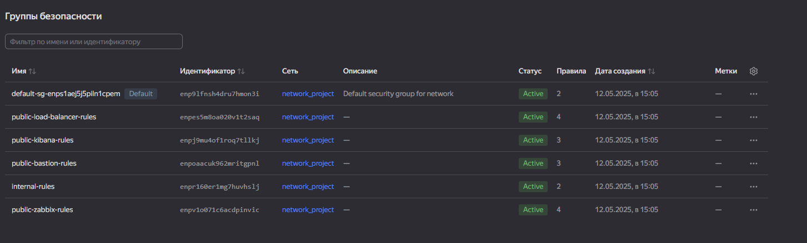

А также посмотрим на каждую группу бузоапсности по отдельности:

**SG_LB**


**SG_internal** с разрешением любого трафика между ВМ кому присвоена данная SG

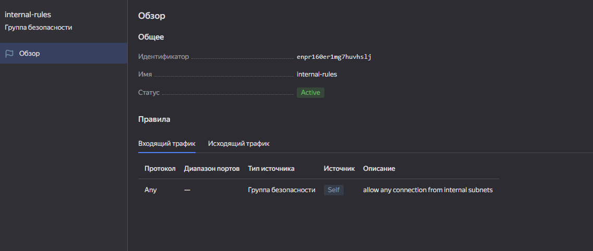

**SG_bastion** c с открытием только 22 порта для работы SSH

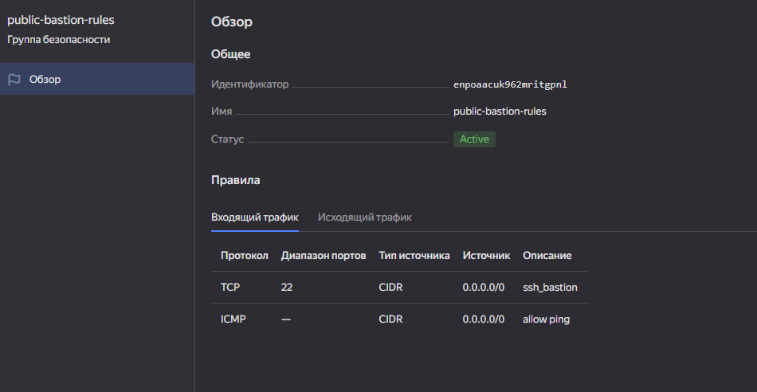


**SG_kibana** c открытым портом 5601 для доступа c интернета к Fronted Kibana

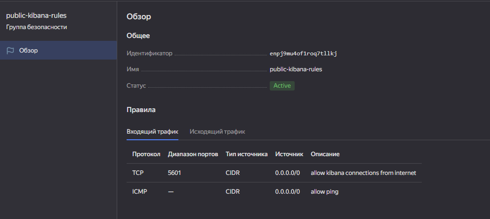

**SG_zabbix** с открытым портом 80 и 10051 для доступа с интернета к Fronted Zabbix и работы Zabbix agent

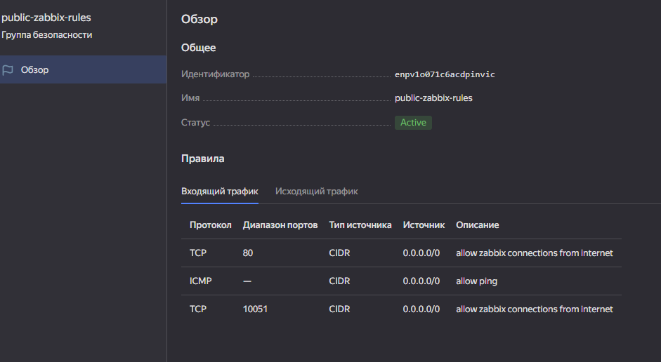

### <a id="balancer">Load Balancer</a>

**Создаем Target Group**

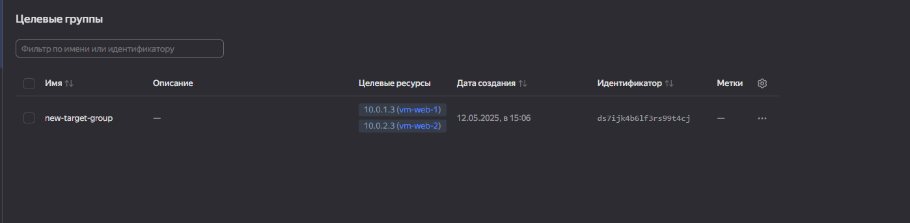

**Создаем Backend Group**

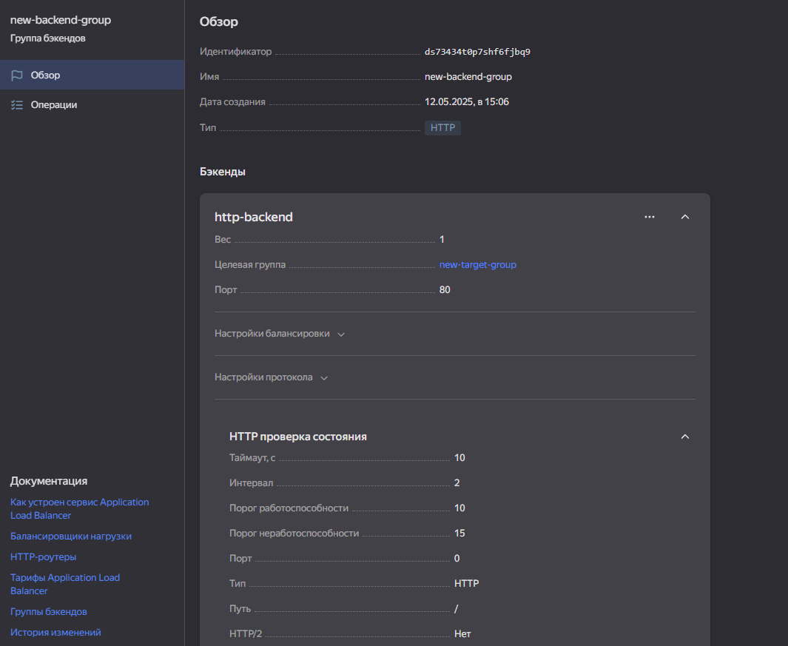

**Создаем HTTP router**

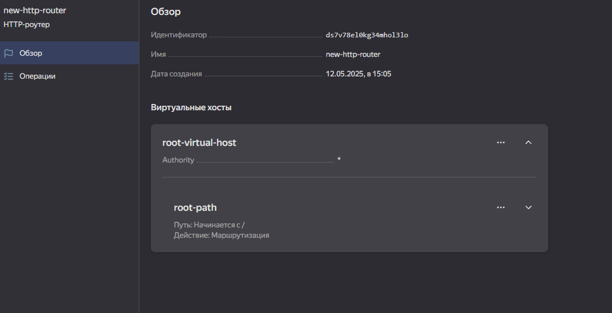

**Создаем Application load balancer**

Для распределения трафика на ранее созданные веб-серверы указываем ранее созданный HTTP роутер, устанавливаем тип listener на auto и выбираем порт 80.

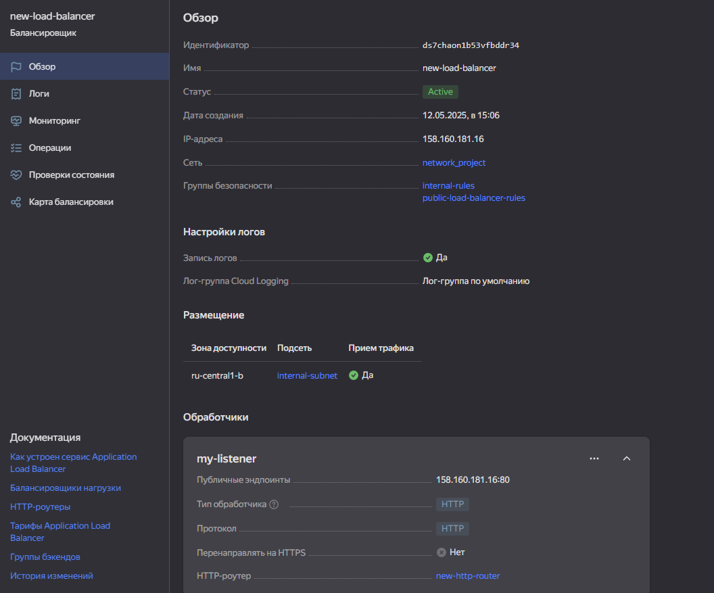


### <a id="snapshot">Резервное копирование</a>

**snapshot**

создаем в terraform блок с расписанием snapshots

```
resource "yandex_compute_snapshot_schedule" "default1" {
  name = "default1"
  description    = "Ежедневные снимки, хранятся 7 дней"

    schedule_policy {
    expression = "0 1 * * *"
  }

```

Переходим в консоль YC и видим созданое расписание, по которому будут происходить обновления.

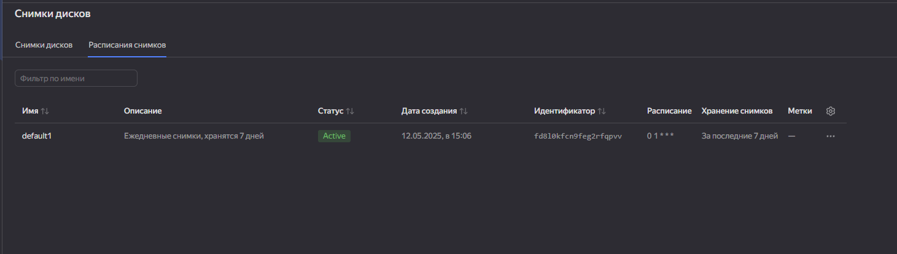

## Ansible

### <a id="cfg">Установка и настройка ansible</a>

Файл host.ini создается автоматически из файла outputs.tf, к WEB серверам будем обращаться по FQDN имени.

```
[all:vars]
ansible_user=alex
ansible_ssh_private_key_file=/home/alex/.ssh/id_ed25519
ansible_ssh_common_args='-o ProxyCommand="ssh -p 22 -W %h:%p -q alex@158.160.30.12"'
  
[log]
elastic_srv ansible_host=elastic.ru-central1.internal
kibana_srv  ansible_host=kibana.ru-central1.internal

[web]
web-1 ansible_host=web1.ru-central1.internal
web-2 ansible_host=web2.ru-central1.internal

[mon]
zabbix_srv ansible_host=zabbix.ru-central1.internal
```

Проверка достпуности хостов

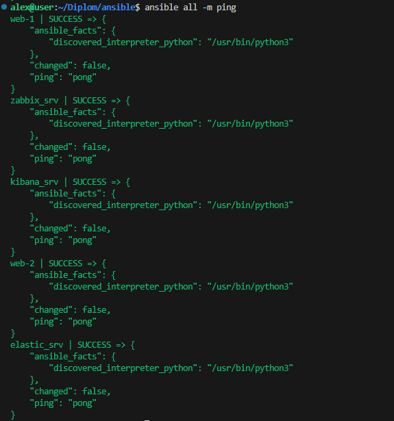

### <a id="web">Установка NGINX и загрузка сайта</a> 

**Устанавливаем NGINX**

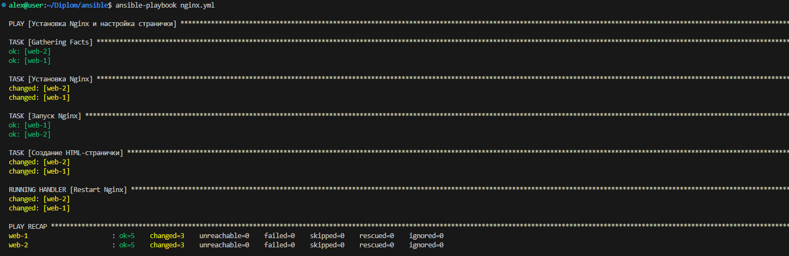

**Проверям его работу в браузере**


**Сделаем несколько запросов в консоли YC и в логах балансировщика увидим, что меняется IP адрес backend**

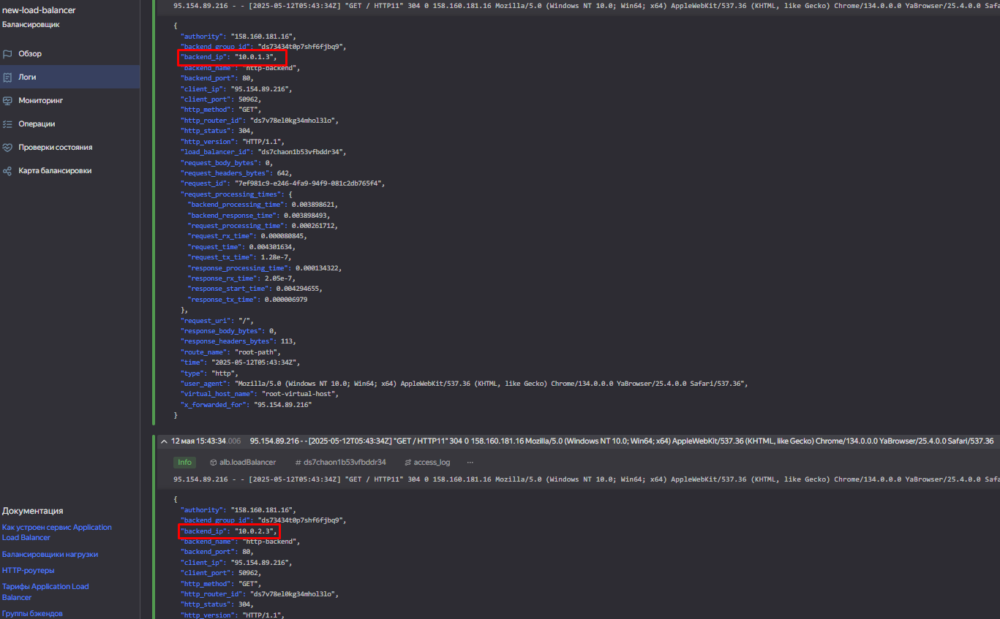


### <a id="zabbix">Мониторинг</a>  

**установка Zabbix**


Проверим работу Zabbix в Web интерфейсе

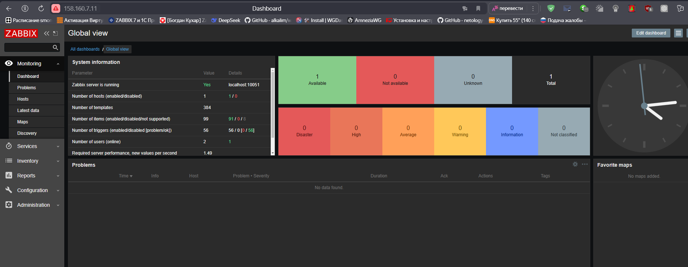

**Установка Zabbix-agent**

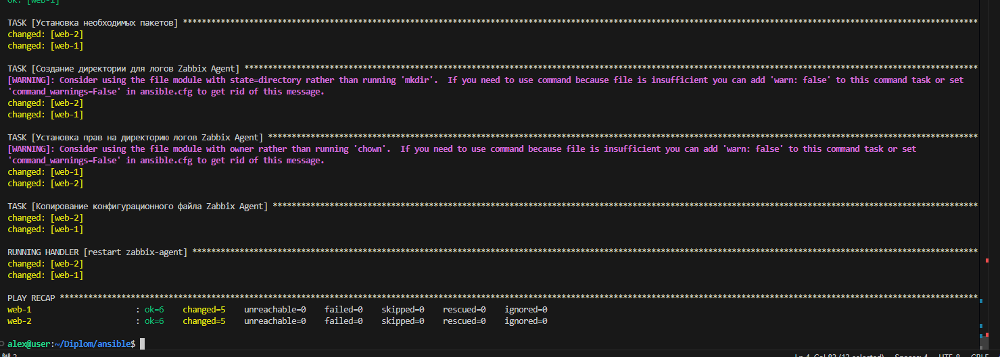

**Проверим статус zabbix agenta на двух web серверах**

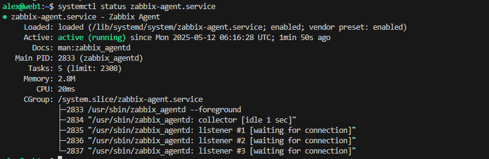

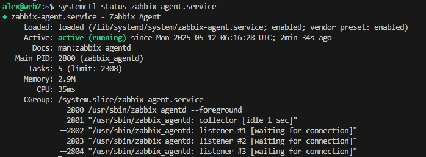

**Добавляем хосты используя FQDN имена в zabbix сервер и настраиваем дашборды**

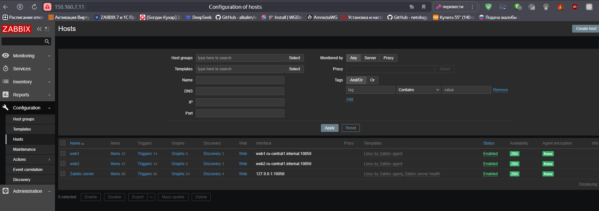

**И создадим дашборд на который выыедем утилизацию CPU RAM и Uptime**

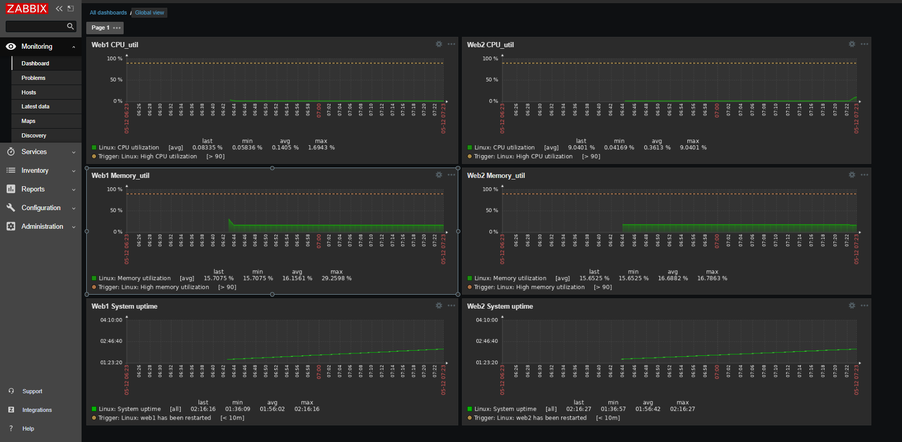

## Установка стека ELK для сбора логов

### <a id="elastic">Установка Elasticsearch</a>

Теперь установим стек ELK начнем с elasticsearch

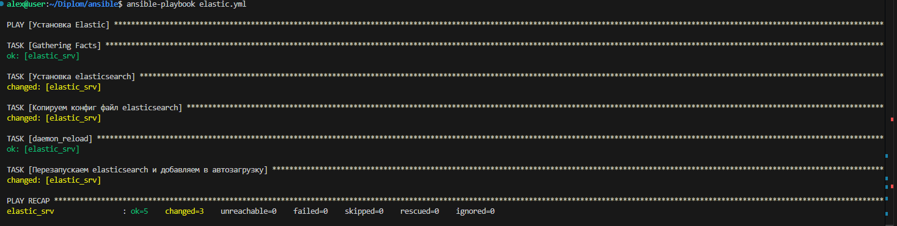

**Посмотрим статус сервиса elasticsearch**

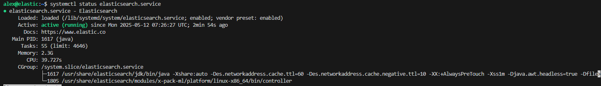

### <a id="kibana">Установка Kibana</a> 

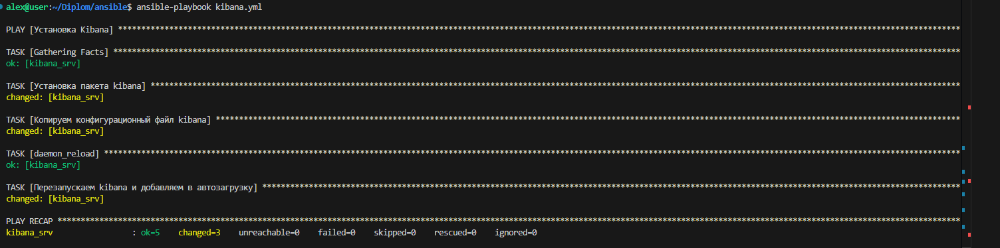

**Проверим статус Kibana**

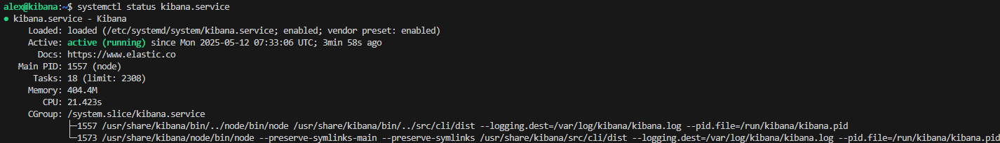

### <a id="filebeat">Установка Filebeat</a> 

**Установим Filebaet на оба web сервера**

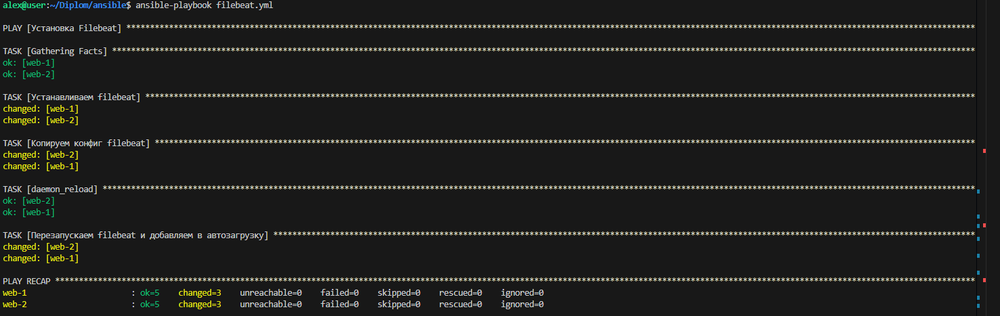

**Проверим в WEB интерефейсе логи с двух web сервером**

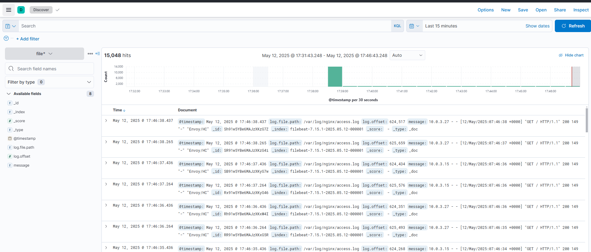
